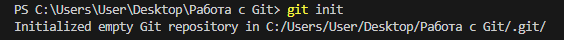

# Что такое Git
>**Git** - это система управления версиями исходногг кода программ. Она позволяет
отслеживать любые изменения в файлах, хранить их версии и оперативно возвращаться в любое созранненое состояние.

# Установка Git и Visual Studio Code
* Установка Git для Windows, MAC, Linux: https://git-scm.com/downloads
* Установка VSCode для Windows, MAC, Linux: https://code.visualstudio.com/Download

При первом использовании Git необходимо представиться.
Для этого нужно ввести в терминале 2 команды:
* ```git config --global user.name «Ваше имя английскими буквами»```
* ```git config --global user.email «Ваша почта»```

# Начало работы с Git
1. Создать папку на рабочем столе - это будет наш **репозиторий**
2. Перейти с помощью проводника в **Visual Studio Code** в созданную папку
3. Инициализировать репозиторий в терминале командой ```git init```

# Основные команды Git

* ```git init``` – инициализация локального репозитория<br>
<br>
* ```git status``` – получить информацию от git о его текущем состоянии<br>
<br>
* ```git add``` – добавить файл или файлы к следующему коммиту<br>
<br>
* ```git commit``` -m “message” – создание коммита.<br>
<br>
* ```git log``` – вывод на экран истории всех коммитов с их хеш-кодами<br>
<br>
* ```git checkout "номер коммита, первые 4 символа"``` – переход от одного коммита к другому<br>
<br>
* ```git checkout master``` – вернуться к актуальному состоянию и продолжить работу<br>

* ```git diff``` – увидеть разницу между текущим файлом и закоммиченным файлом<br>

### Работа с ветками
* ```git branch``` - посмотреть список веток<br>
<br>
* ```git branch "название ветки"``` - создать ветку (новая ветка унаследует коммиты родительской ветки)<br>
<br>
Видим что в списке веток появилась новая, которую мы создали<br>
* ```git checkout "название ветки"``` - перейти на ветку<br>
<br>
В начале мы находились в ветке **master**(она отмечена звездочкой и выделена зеленем цветом), затем после использования команды<br>
мы перешли в ветку **image**(теперь она выделяется звездочкой и цветом)<br>
* ```git branch -d "название ветки"``` - удалить ветку после merge<br>
<br>
* ```git branch -D "название ветки"``` - удалить ветку принудительно<br>
* ```git merge "название сливаемой ветки"``` - сливание веток<br>
<br>
<br>

# Синтаксис языка Markdown
>Язык разметки **Markdown** широко распространен в вебе. На нем пишут readme-файлы и документацию,
а его принципы работы используют для оформления сообщений и публикаций в мессенджерах и социальных сетях

* **#** Заголовок – выделение заголовков. Количество символов “#” задаёт уровень заголовка 
(поддерживается 6 уровней)
* = или - – подчёркиванием этими символами (не менее 3 подряд) выделяют заголовки первого 
(“=”) и второго (“-”) уровней.
* ** **Полужирное начертание** ** или __ __Полужирное начертание__ __
*  **Курсивное начертание* * или 
_ _Курсивное начертание_ _
* *** ***Полужирное курсивное начертание*** ***
* ~~ ~~Зачёркнутый текст~~ ~~
* *Строка – ненумерованные списки, символ “ * ” в начале строки
* 1, 2, 3 … – нумерованные списки. Для создания нумерованного списка перед пунктами нужно поставить число с точкой.

### Параграфы и разрывы строк
Чтобы **поделить текст на парграфы**, между ними нужно оставить пустую строку.
Если же строки находятся рядом, то они автоматически склеиваются в одну.

**Для переноса строки** внутри одного параграфа есть три метода:
* поставить в конце строки два или более пробела;
* поставить в конце строки обратную косую черту
* использовать HTML-тег <br*> (без знака" * ")

### Разделители
Чтобы оформить горизонтальный разделитель, нужно поставить три или более специальных символа: звездочки,\
дефиса или нижних подчеркивания.
Они должны находиться на отдельной строке, и между ними можно ставить любое количество пробелов и табуляций
***
Если редактор поддерживает HTML-теги, то для разметки можно также использовать тег <hr*> (без знака" * ")

### Цитаты
Чтобы параграф отобразился как цитата, нужно поставить перед ним закрывающую угловую скобку ">"
>Оформление цитатой строк внутри параграфа

Внутрь одного блока цитаты можно поместить сразу несколько параграфов и использовать любые элементы оформления.

### Чекбоксы
Чтобы сделать чекбоксы, нужно использовать маркированный список, но между маркером и текстом поставить [x*](без знака" * ") для отмеченного пункта,
и [] - для неотмеченного
* [x] отмеченный пункт
* [ ] неотмеченный пункт

### Вложенные списки
Чтобы создать вложенный список, нужно поставить перед его пунктами табуляцию или несколько пробелов. В Markdown одна табуляция соответствует четырём пробелам
* Пункт
    * Подпункт
        * Подподпункт
